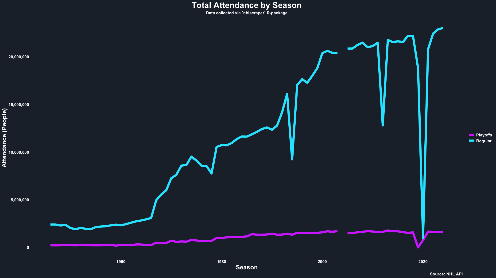
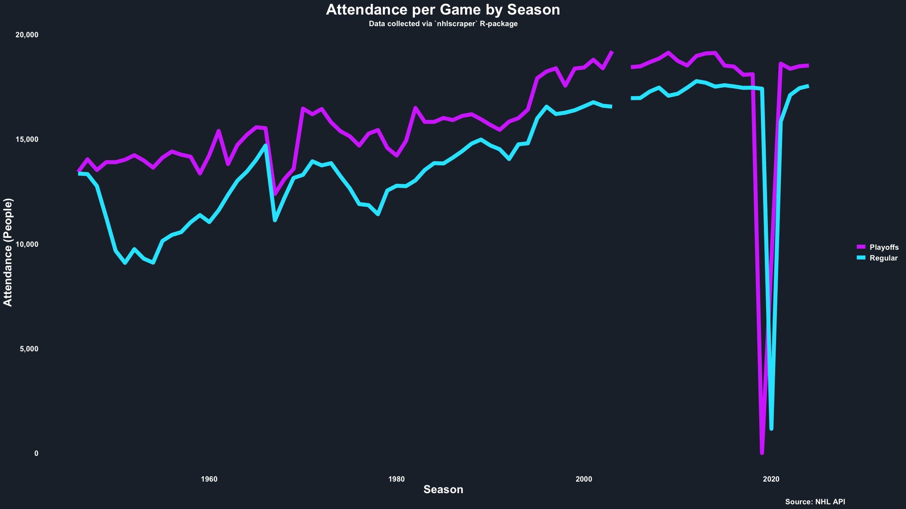

```{r, include = FALSE}
knitr::opts_chunk$set(
  collapse = TRUE,
  comment = '#>'
)
```

This example explores how one may create `ggplot2` line graphs for total attendance and attendance per game across all seasons. Please contact me with your cool examples, and I can add them here too!
```{r example}
# Load libraries.
library(nhlscraper)
library(tidyverse)

# Set colors.
charcoal <- '#202A35'
n_cyan <- '#1EE6FF'
m_purple <- '#D443FF'

# Clean data.
all_seasons <- get_seasons() %>% 
  mutate(seasonId=id)
all_attendance <- get_attendance() %>%
  mutate(seasonStart=seasonId%/%10000) %>%
  select(
    seasonId, 
    seasonStart, 
    Regular=regularAttendance, 
    Playoffs=playoffAttendance
  ) %>% 
  left_join(all_seasons, by='seasonId') %>% 
  mutate(
    `Regular per Game`=Regular/totalRegularSeasonGames, 
    `Playoffs per Game`=Playoffs/totalPlayoffGames
  ) %>% 
  select(
    seasonStart, 
    Regular, 
    Playoffs, 
    `Regular per Game`, 
    `Playoffs per Game`
  )
all_attendance_long <- all_attendance %>%
  pivot_longer(c(Regular, Playoffs), names_to='type', values_to='attendance')
attendance_pg_long <- all_attendance %>% 
  select(
    seasonStart, 
    Regular=`Regular per Game`, 
    Playoffs=`Playoffs per Game`
  ) %>% 
  pivot_longer(
    c(Regular, Playoffs), 
    names_to='type', 
    values_to='attendance'
  )

# Total Attendance
ggplot(all_attendance_long, aes(x=seasonStart, y=attendance, color=type)) +
  geom_line(linewidth=3) +
  scale_color_manual(values=c(Regular=n_cyan, Playoffs=m_purple)) +
  scale_y_continuous(labels=comma_format()) +
  labs(
    title='Total Attendance by Season',
    subtitle='Data collected via `nhlscraper` R-package',
    caption='Source: NHL API',
    x='Season',
    y='Attendance (People)',
    color=NULL
  ) +
  theme_minimal(base_family='') +
  theme(
    panel.grid=element_blank(),
    plot.background=element_rect(fill=charcoal, color=NA),
    panel.background=element_rect(fill=charcoal, color=NA),
    legend.background=element_rect(fill=charcoal, color=NA),
    legend.key=element_rect(fill=charcoal, color=NA),
    text=element_text(color='white'),
    plot.title=element_text(color='white', face='bold', size=24, hjust=0.5),
    plot.subtitle=element_text(color='white', face='bold', size=12, hjust=0.5),
    plot.caption=element_text(color='white', face='bold', size=12),
    axis.text=element_text(color='white', face='bold', size=12),
    axis.title=element_text(color='white', face='bold', size=18),
    legend.text=element_text(color='white', face='bold', size=12)
  )

# Attendance per Game
ggplot(attendance_pg_long, aes(x=seasonStart, y=attendance, color=type)) +
  geom_line(linewidth=3) +
  scale_color_manual(values=c(Regular=n_cyan, Playoffs=m_purple)) +
  scale_y_continuous(labels=comma_format()) +
  labs(
    title='Attendance per Game by Season',
    subtitle='Data collected via `nhlscraper` R-package',
    caption='Source: NHL API',
    x='Season',
    y='Attendance (People)',
    color=NULL
  ) +
  theme_minimal(base_family='') +
  theme(
    panel.grid=element_blank(),
    plot.background=element_rect(fill=charcoal, color=NA),
    panel.background=element_rect(fill=charcoal, color=NA),
    legend.background=element_rect(fill=charcoal, color=NA),
    legend.key=element_rect(fill=charcoal, color=NA),
    text=element_text(color='white'),
    plot.title=element_text(color='white', face='bold', size=24, hjust=0.5),
    plot.subtitle=element_text(color='white', face='bold', size=12, hjust=0.5),
    plot.caption=element_text(color='white', face='bold', size=12),
    axis.text=element_text(color='white', face='bold', size=12),
    axis.title=element_text(color='white', face='bold', size=18),
    legend.text=element_text(color='white', face='bold', size=12)
  )
```


